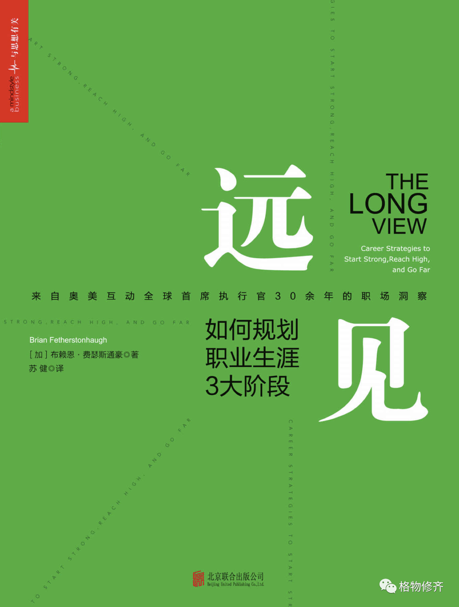

# 职业生涯的思考

今天在看一本书，看了一部分，觉得有些启发。

工作其实挺久了，这么多年，常常间歇性迷茫。

唠叨一些背景：

刚毕业两年的时候，一开始进步很快，工作打鸡血，包夜解决问题。

过了一段时间，就开始迷茫，觉得没什么好搞的，工作没意思。

后来，做了新的东西，觉得挺有激情，也是膨胀很快，觉得自己很厉害，啥都能做。

再后来，换了个角色，总感觉被角色所累，开始谦卑，不能做挫了，不能让一起的人失去信心；总感觉好像做不了什么。「管理还是技术？」这是一个纠结的问题，好久。不搞管理，搞技术！

蹦跶了一段时间，学习、改进，各种架构、技术不就是这样，都是套路。遇到问题，能解决！解决方案总比问题多。

后来听说了一个词，「政治」。挺麻烦，不知不觉也卷了进去。考虑人的问题，比解决技术问题复杂多了。

再后来，又开始纠结那个问题，「管理还是技术？」知识焦虑，感觉好像什么都不太懂，但是遇到问题，大多能搞定；而有些关键问题，搞不定也讲不清楚，东西太多，被淹没了。看看周围，什么级别的都是渣渣。为啥他们不焦虑还挺自信？

后来，学了一套套方法，不焦虑了，搞个套路，按部就班不就行了，持续学习和持续改进学习方法的方法，问题来一个解决一个，也许不系统。还给一批人传道洗脑，打鸡血。

再后来，工作是为了啥？很多事情，大家都推来推去，挑对自己有利的搞。不知道自己要什么，做了也不一定又什么意义，所以做什么都一样。但是浪费的时间回不来啊，有点丧。

......

好像一直是一个循环，走不出来。也许是没有一个目标和规划。间歇性自虐。

说回这本书，倒是给了我一些指导和启发。

职业生涯实际上是很长的，大约有四五十年。如果以这么长的跨度来看，一两年内的利益或者得失似乎是微不足道的。

「一个人的个人财富往往在65岁左右达到巅峰，而他们在40岁时的个人财富只有那个数字的10%～15%」

作者把职业生涯看作是四五十年的马拉松，并划分了三个不同的阶段，每个阶段有不同的目标或者说侧重点。  

比如工作前15年，是第一个阶段，主要是积蓄能量「燃料」和搞好装备，建立好习惯，也就是打基础；工作中间15年，是第二个阶段，主要是发挥长处，大干一场，到达高点；工作最后15年，是第三个阶段，主要是优化长尾、发挥持续影响力。

这就是把自己在职业生涯中当作一个产品做，给职业生涯规划的三个连续版本。后一个版本都是依赖前一个版本的能力。

其实之前也看到马云讲过类似的「20岁到30岁，跟人干；30岁开始，积累了这么多年，袖子一拉，自己干；40岁到50岁，要做自己最强的事情，这个时候你不要晃来晃去了；50岁到60岁，要帮着年轻人干；60岁到70岁，那就踏踏实实在家里干」

当然，阶段划分的时间也只是一个标识，具体是多少，还是要看个人。

有了这个路线，其实是可以按部就班来了。但缺一个，也就是目标，灯塔。想想做产品，但是搞不清楚为什么做、不知道做什么，版本发了一个又一个又有啥用。

也许有用，在过程中归纳和清晰化目标。

「弄清楚你的使命、从事你愿意投入的事业」

「要寻找三样东西：你擅长什么，你热爱什么，以及这个世界需要什么？」

带着这些问题，在第一阶段实际上是积累。作者总结了三种「职场燃料」，这些都可以看作是一些阶段性的目标：

1. 可迁移技能
   1. 解决问题的能力
   2. 说服式沟通技巧
   3. 完成任务的能力
   4. 「人才引力」
   5. 帮助和求助的能力
   6. 情商、理解和连接他人情绪的能力
2. 有意义的经验
   1. 多样的经历
   2. 处理危机的经历
   3. 应对失败的经历 
3. 持久的关系
   1. 上司
   2. 客户
   3. 商业伙伴
   4. 身边的人才
   5. 找到你的同类

我觉得我还处在第一阶段，所以后面的阶段先不展开。

那么，在第一阶段，「搞技术还是管理？」这只是一个表象，不应该纠结，两种方式只是在不同的位置，锻炼不同的技能。过程中，思考和找到那三样东西「你擅长什么，你热爱什么，以及这个世界需要什么？」是关键。作者也举了一些例子挺有指导性。

至于要做什么事情才是有意义的，可以以这些「职场燃料」作为指导，缺哪一点，或者说需要提升哪一点，就围绕这点，来判断哪些事情是需要做的，哪些事情是可以不做的，哪些东西需要争取。

好吧，找到了一个套路。我又可以暂时不纠结了。也许是一种螺旋式的方式吧。

希望对你也有点用。

「要寻找三样东西：你擅长什么，你热爱什么，以及这个世界需要什么？」

