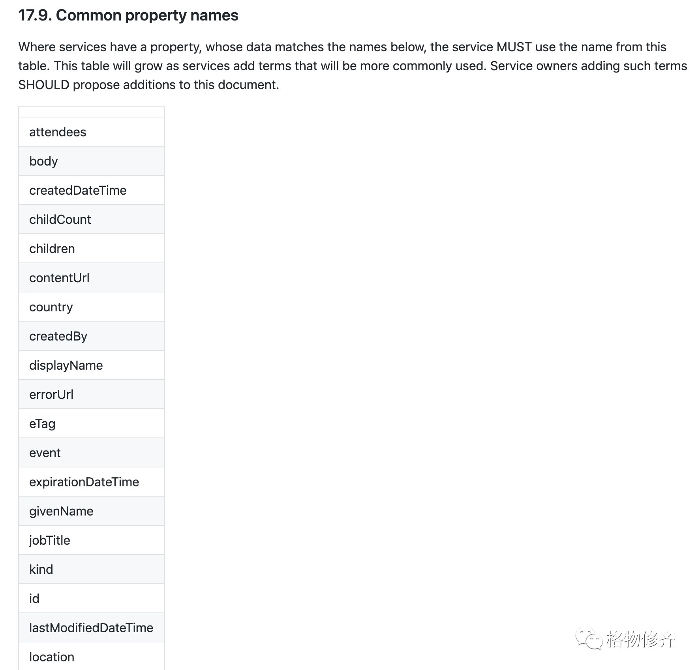

# 处事方法归纳

​今天不讲技术，但从看技术文档想到了一些做法，在其他方面仍然适用。总结分享一下。

先看看微软的REST API指南里面的一段内容：

这里其实是把常用的命名管理起来了。要取一个新名字前，先看列表里面有没有：如果有，就直接用；如果没有，就按规则取一个，并添加到这个列表。

这样很好的做到了统一，并且还解决了“取名字纠结症”的问题。

这就是一种好的方法。

归纳一下，针对某个事情的行动：

* 列清单-&gt;完善清单
* 在清单中按照一定规则选择行动

演绎一下。比如，你不擅长寒暄，那么可以弄一个反应清单，格式可以是：

* 遇到熟人
  * 随便了，想到什么说什么
* 遇到陌生人
  * 微笑
  * 点头
* 遇到新同事，问过去的事情，比如：
  * 老家哪里？
  * 读书学的什么？
  * 周末做饭吗？
  * 最近工作咋样？

类似这个也可以作为复盘或者反思的一个结果形式。

把所有的场景、对应的规则和对应的选择总结下来，遇到某个场景，就直接按照规则选择那唯一的一个即可；定期通过复盘或者总结的方式，来改进这个规则。

是不是很熟悉？这就是一个简版的心智模型，在某个场景下的单维度投影；这些规则就是你的行事原则；这个清单就是表现形式。只是如果不列出来，这个过程会在你的脑袋里，像几个小人在打架，最终会有个结果，但是不好分析和重现；想想是不是跌倒一次又一次，被坑一次又一次、纠结一次又一次

这种方法，应该可以规避掉“选择恐惧症”、“焦虑”、“尴尬症”，也能够稳定和透明地提升自己。

这个思路，其实在GTD里面也有类似的，把所有的事情记下来，然后有一套流程/规则来分类考虑、组织和执行。

很久以前写过一篇《[出差必备](http://mp.weixin.qq.com/s?__biz=MjM5MTM4NDE3Mg==&mid=2247483713&idx=1&sn=3e21d6fe0b9ac56256f6265155a76e50&chksm=a6b7164291c09f544a4130ed5d6fdd5ad78ff9981a6df156820d69ca37719aed0ff88d8fdc30&scene=21#wechat_redirect)》就是类似的，只是之前没有这么想过。

